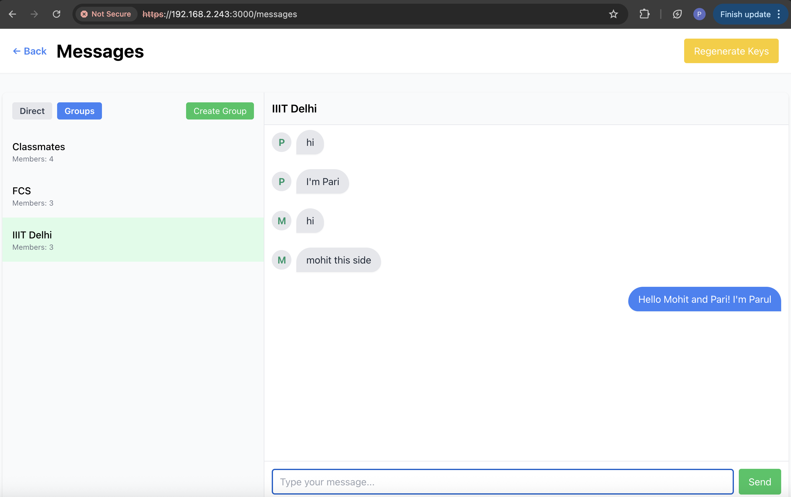
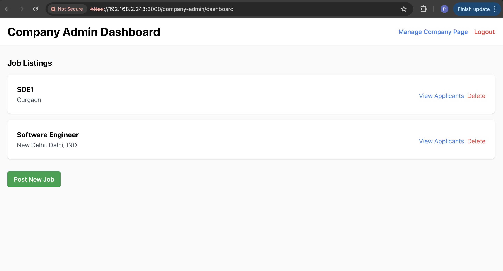
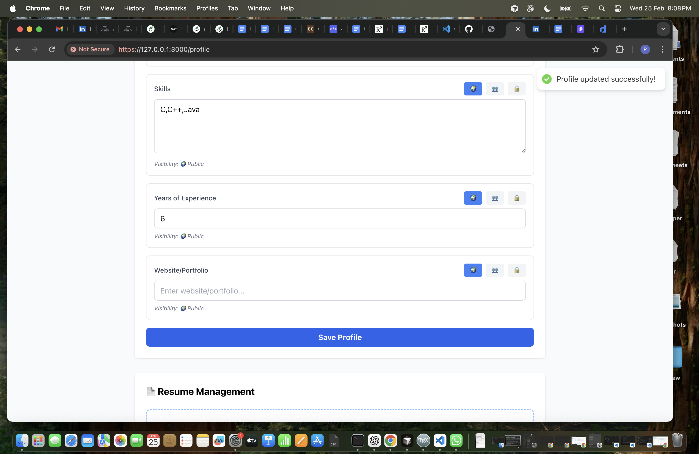

# SecureConnect — Secure Job Search & Professional Networking Platform

A full-stack secure job portal built with **FastAPI**, **React**, and **PostgreSQL**, featuring end-to-end encrypted messaging, encrypted resume storage, and tamper-evident audit logging.

> Built for CSE 345/545: Foundations of Computer Security | IIIT Delhi | March 2026

---

## Screenshots

### E2EE Group Messaging
End-to-end encrypted group chat using NaCl (Curve25519 + XSalsa20 + Poly1305). The server stores only ciphertext — zero-knowledge architecture.



### Company Admin Dashboard
Recruiters can manage job listings, view applicants, and update application status.



### Job Search & Application Tracking
Job seekers can search, filter, and apply to jobs with real-time status tracking.


### Login Page
OTP-based passwordless authentication with virtual keyboard for keylogger protection.


### User Profile with Privacy Controls
Per-field privacy settings (public, connections-only, private) with application status tracking.



### Encrypted Resume Upload
AES-256-GCM encryption with RSA-2048 digital signatures for non-repudiation.


---

## Tech Stack

| Layer | Technology | Purpose |
|-------|-----------|---------|
| Frontend | React 18, Vite, TailwindCSS, Zustand | SPA with client-side E2EE |
| Backend | FastAPI (Python 3.11), Pydantic, SQLAlchemy | REST API with RBAC |
| Database | PostgreSQL 16 | ACID-compliant data store |
| Encryption | TweetNaCl.js, Python cryptography | E2EE messaging + AES-256-GCM |
| Infrastructure | NGINX, Docker Compose | TLS termination, rate limiting |

---

## Security Architecture

**Layer 1 — Network:** HTTPS/TLS 1.3 via NGINX, HSTS, CSP, rate limiting (5 req/min on auth)

**Layer 2 — Authentication:** OTP-based passwordless login (PBKDF2, 100K iterations), JWT (httpOnly cookies, 30-min access / 7-day refresh), virtual keyboard

**Layer 3 — Application:** Pydantic validation, SQLAlchemy ORM (parameterized queries), React auto-escaping, CSRF protection

**Layer 4 — Data:** AES-256-GCM resume encryption + RSA-2048 signatures, NaCl E2EE messaging (zero-knowledge), per-field profile privacy

**Layer 5 — Accountability:** SHA-256 hash-chained audit logs, IP/user-agent tracking, non-repudiation via PKI

---

## Features

- **OTP Authentication** — Passwordless login with PBKDF2 hashing, virtual keyboard, 3-attempt limit
- **JWT Sessions** — httpOnly secure cookies, 30-min access + 7-day refresh tokens, RBAC (User/Recruiter/Admin)
- **E2EE Messaging** — NaCl encryption (Curve25519 + XSalsa20 + Poly1305), 1-to-1 and group chat, zero-knowledge server
- **Resume Encryption** — AES-256-GCM at rest, RSA-2048 digital signatures, RBAC-enforced download with audit logging
- **Job Management** — Post, search, apply, track applications (Applied → Reviewed → Interviewed → Offered)
- **Profile Privacy** — Per-field controls (public/connections/private), API-level filtering
- **Audit Logs** — SHA-256 hash-chained entries, tamper detection, chain verification endpoint

---

## Setup

```bash
# Clone
git clone https://github.com/parulahlawat/Secure_Job_Platform.git
cd Secure_Job_Platform

# Generate TLS certificates
bash generate-certs.sh

# Backend
cd backend
cp .env.example .env
pip install -r requirements.txt
uvicorn app.main:app --reload --port 8000

# Frontend
cd ../frontend
npm install
npm run dev
```

---

## OWASP Top 10 Coverage

| # | Vulnerability | Defense |
|---|--------------|---------|
| A01 | Broken Access Control | RBAC + per-field privacy |
| A02 | Cryptographic Failures | AES-256-GCM, NaCl E2EE, TLS 1.3 |
| A03 | Injection | SQLAlchemy parameterized queries |
| A05 | Security Misconfiguration | Secure headers, .env separation |
| A07 | Auth Failures | OTP + JWT + rate limiting |
| A08 | Integrity Failures | Hash-chained logs, RSA signatures |
| A09 | Logging Failures | Comprehensive audit module |

---

*Developed by Parul Ahlawat — CSE 345/545, IIIT Delhi*
